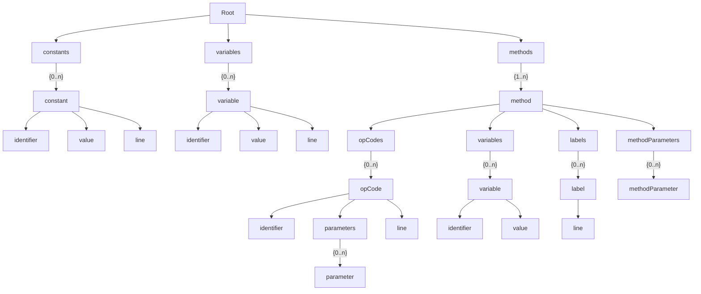

```mermaid
graph TB
    R[Root]
    VAL1[value]
    VAL2[value]
    VAL4[value]
    I1[identifier]
    I2[identifier]
    I4[identifier]
    I6[identifier]
    C[constants]
    C1[constant]
    VS1[variables]
    VS3[variables]
    V1[variable]
    V3[variable]
    METPS[methodParameters]
    METP[methodParameter]
    MET[method]
    METS[methods]
    OPC2[opCodes]
    OP2[opCode]
    PS2[parameters]
    P2[parameter]
    LS2[labels]
    L2[label]
    LN1[line]
    LN2[line]
    LN3[line]
    LN4[line]


    R-->C
    R-->VS1
    R-->METS

    METS-- {1..n} -->MET

    C-- {0..n} -->C1
    C1-->I1
    C1-->VAL1
    C1-->LN1

    VS1-- {0..n} -->V1
    V1-->I2
    V1-->VAL2
    V1-->LN2

    MET-->OPC2
    OPC2-- {0..n} -->OP2
    OP2-->I4
    OP2-->PS2
    PS2-- {0..n} -->P2
    MET-->VS3
    VS3-- {0..n} -->V3
    V3-->I6
    V3-->VAL4
    MET-->LS2
    LS2-- {0..n} -->L2
    L2-->LN4
    OP2-->LN3
    MET-->METPS
    METPS-- {0..n} -->METP
```