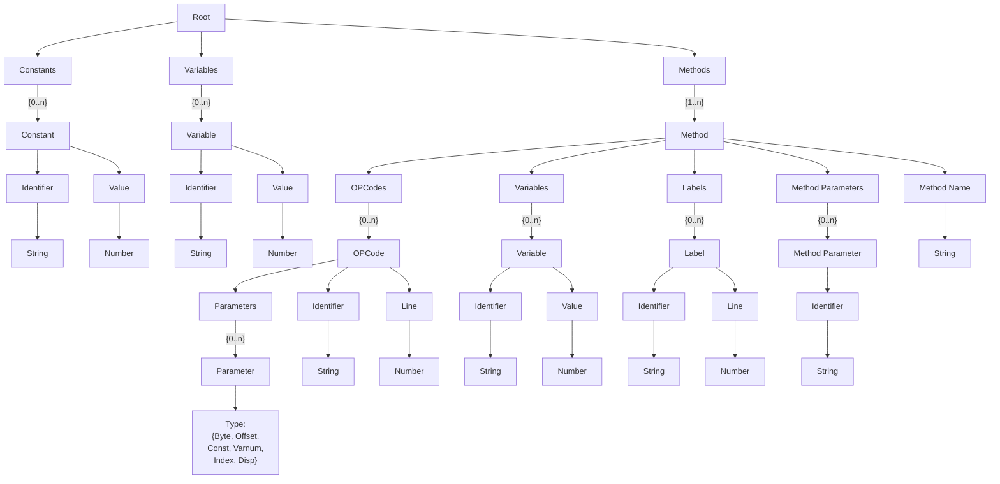

```mermaid
graph TB
    R[Root]
    VAL1[Value]
    VAL2[Value]
    VAL4[Value]
    I1[Identifier]
    I2[Identifier]
    I4[Identifier]
    I6[Identifier]
    I8[Identifier]
    I9[Identifier]
    C[Constants]
    C1[Constant]
    VS1[Variables]
    VS3[Variables]
    V1[Variable]
    V3[Variable]
    METPS[Method Parameters]
    METP[Method Parameter]
    MET[Method]
    METS[Methods]
    METN[Method Name]
    OPC2[OPCodes]
    OP2[OPCode]
    PS2[Parameters]
    P2[Parameter]
    LS2[Labels]
    L2[Label]
    S1[String]
    S2[String]
    S4[String]
    S6[String]
    S8[String]
    S9[String]
    S10[String]
    N1[Number]
    N2[Number]
    N4[Number]
    N7[Number]
    N8[Number]
    LN3[Line]
    LN4[Line]
    TP2["Type: 
    {Byte, Offset, 
    Const, Varnum, 
    Index, Disp}"]


    R-->C
    R-->VS1
    R-->METS

    METS-- {1..n} -->MET

    C-- {0..n} -->C1
    C1-->I1
    I1-->S1
    C1-->VAL1
    VAL1-->N1

    VS1-- {0..n} -->V1
    V1-->I2
    I2-->S2
    V1-->VAL2
    VAL2-->N2

    MET-->OPC2
    OPC2-- {0..n} -->OP2
    OP2-->PS2
    OP2-->I4
    I4-->S4
    PS2-- {0..n} -->P2
    P2-->TP2
    MET-->VS3
    VS3-- {0..n} -->V3
    V3-->I6
    V3-->VAL4
    I6-->S6
    VAL4-->N4
    MET-->LS2
    LS2-- {0..n} -->L2
    L2-->I8
    I8-->S8
    L2-->LN4
    OP2-->LN3
    LN3-->N7
    LN4-->N8
    MET-->METPS
    METPS-- {0..n} -->METP
    METP-->I9
    I9-->S9
    MET-->METN
    METN-->S10
```