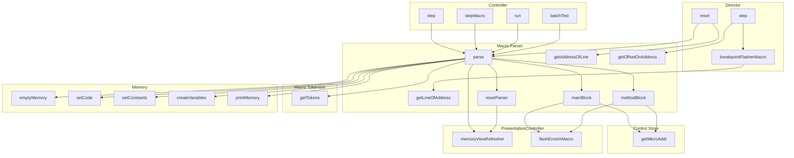

```mermaid
graph TD
    subgraph C[Controller]
        C-S[step]
        C-SM[stepMacro]
        C-R[run]
        C-BT[batchTest]
    end

    subgraph D[Director]
        D-S[step]-->D-BPFM
        D-BPFM[breakpointFlasherMacro]
        D-R[reset]
    end

    subgraph MP[Macro Parser]
        MP-P[parse]
        MP-GLOA[getLineOfAddress]
        MP-GAOL[getAddressOfLine]
        MP-GOOA[getOffsetOnAddress]
        MP-MaB[mainBlock]
        MP-MeB[methodBlock]
        MP-RP[resetParser]

        style MP-P width:

        MP-P-->MP-MaB
        MP-P-->MP-MeB
        MP-P-->MP-RP
    end

    subgraph MT[Macro Tokenizer]
        MT-GT[getTokens]
    end

    subgraph M[Memory]
        M-EM[emptyMemory]
        M-SC[setCode]
        M-SCst[setConstants]
        M-CV[createVariables]
        M-PM[printMemory]
    end

    subgraph CS[Control Store]
        CS-GMA[getMicroAddr]
    end

    subgraph PC[PresentationController]
        PC-MVR[memoryViewRefresher]
        PC-FEIM[flashErrorInMacro]
    end


    C-S-->MP-P
    C-SM-->MP-P
    C-R-->MP-P
    C-BT-->MP-P
    D-BPFM-->MP-GLOA
    D-S-->MP-GOOA
    D-R-->MP-P
    D-R-->MP-GAOL

    MP-P-->MT-GT
    MP-P-->M-EM
    MP-P-->M-SC
    MP-P-->M-SCst
    MP-P-->M-CV
    MP-P-->M-PM
    MP-P-->PC-MVR
    MP-MaB-->CS-GMA
    MP-MaB-->PC-FEIM
    MP-MeB-->CS-GMA
    MP-MeB-->PC-FEIM
    MP-RP-->PC-MVR
```